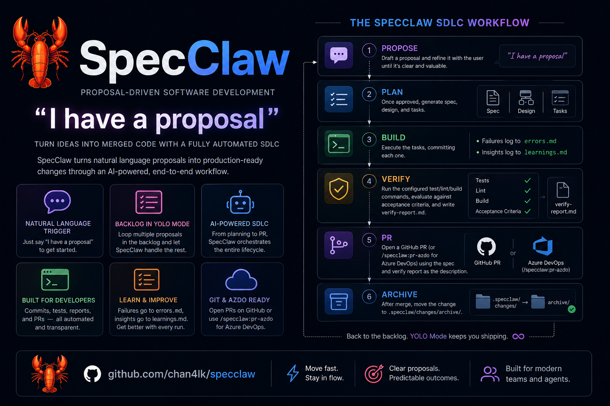

<div align="center">

# 🦞 SpecClaw

### _"I have a proposal."_

**Spec-driven development for Claude Code.** Turn a plain-English idea into merged, production-ready code through a fully automated SDLC.



[](https://github.com/chan4lk/specclaw/actions/workflows/ci.yml)
[](https://github.com/chan4lk/specclaw/releases)
[](LICENSE)
[](https://claude.com/claude-code)
[](https://github.com/chan4lk/specclaw/stargazers)
[](CONTRIBUTING.md)

</div>

Just say **"I have a proposal"** — SpecClaw manages the full lifecycle of a code change: propose → plan → build → verify → pr. It writes structured proposals, specs, designs, and ordered task lists into your project, then drives implementation through the lifecycle with full traceability from requirement to merged PR.

> **Try it in 30 seconds:** `/plugin marketplace add chan4lk/specclaw` → `/plugin install specclaw@chan4lk` → `/specclaw:init`

## Why SpecClaw?

AI coding agents are powerful but lose context fast. SpecClaw gives every change a paper trail:

- **`proposal.md`** — why this change matters
- **`spec.md`** — requirements + acceptance criteria
- **`design.md`** — technical approach, file map, key decisions, risks
- **`tasks.md`** — ordered tasks, grouped into parallelizable waves
- **`verify-report.md`** — evidence the implementation meets the spec
- **GitHub / Azure DevOps / Jira sync** — keep external trackers up to date

Each change lives in `.specclaw/changes/<name>/` in your repo. The plugin operates on your project's CWD; nothing is hidden inside the plugin install.

## Installation

Requires [Claude Code](https://claude.com/claude-code) v2.1 or later.

```
/plugin marketplace add chan4lk/specclaw
/plugin install specclaw@chan4lk
```

Future plugins by the same owner ship in the same `chan4lk` marketplace — you only register it once.

## Quickstart

```
> /specclaw:init
  Initializes .specclaw/ in the current project, generates config.yaml, creates the dashboard.

> /specclaw:propose "add dark mode support"
  Drafts .specclaw/changes/add-dark-mode/proposal.md for your review.

> /specclaw:plan add-dark-mode
  Generates spec.md, design.md, tasks.md once the proposal is approved.
  Append --author-spec to author spec.md interactively via the spec-author subagent, with an approval gate before design.md / tasks.md.

> /specclaw:build add-dark-mode
  Executes tasks wave-by-wave, committing each.

> /specclaw:verify add-dark-mode
  Runs tests/lint/build, evaluates against acceptance criteria, writes verify-report.md.

> /specclaw:pr add-dark-mode
  Opens a GitHub PR using the spec + verify report as the description.
```

## Project Structure

When initialized in a project, SpecClaw creates:

```
.specclaw/
├── config.yaml          # Project config (models, git strategy, integrations)
├── STATUS.md            # Cross-change dashboard
├── patterns.md          # Recurring pattern registry (cross-change)
└── changes/
    └── <change-name>/
        ├── proposal.md      # Problem + solution + scope
        ├── spec.md          # Requirements + acceptance criteria
        ├── design.md        # Technical approach + file map
        ├── tasks.md         # Ordered tasks with status markers
        ├── status.md        # Per-change progress tracking
        ├── errors.md        # Build error journal (auto-generated on failures)
        ├── learnings.md     # Build learnings (spec gaps, patterns, insights)
        └── verify-report.md # Verification results
```

## Commands

All commands are namespaced under `/specclaw:`. Most are model-invokable — Claude will route conversationally (e.g. "i have a proposal" fires `/specclaw:propose`). Auth setup commands (`/specclaw:auth-azdo`, `/specclaw:auth-jira`) are explicit-only because they handle credentials.

| Command | Purpose |
|---------|---------|
| `/specclaw:init` | Initialize `.specclaw/` in the current project |
| `/specclaw:propose "<idea>"` | Draft a new change proposal |
| `/specclaw:plan <change>` | Generate spec + design + tasks (append `--author-spec` for interactive spec authoring with an approval gate) |
| `/specclaw:author-spec <change>` | Author `spec.md` interactively via the `spec-author` subagent (5 Whys, JTBD, Inversion, Pre-mortem, MoSCoW) |
| `/specclaw:build <change>` | Execute tasks wave-by-wave |
| `/specclaw:learn <change> "..."` | Record a spec gap, design miss, or pattern |
| `/specclaw:patterns` | Inspect the cross-change pattern registry |
| `/specclaw:verify <change>` | Validate implementation against spec |
| `/specclaw:pr <change>` | Open a GitHub PR |
| `/specclaw:pr-azdo <change>` | Open an Azure DevOps PR |
| `/specclaw:auth-azdo` | One-time Azure DevOps credentials setup |
| `/specclaw:auth-jira` | One-time Jira credentials setup |
| `/specclaw:issue <change>` | Create a Jira issue from a proposal |
| `/specclaw:azdo-issue <change>` | Create an Azure Boards Work Item from a proposal |
| `/specclaw:status` | Show the project dashboard |
| `/specclaw:archive <change>` | Archive a completed change |
| `/specclaw:auto` | Advance the queue of active changes autonomously |

## Configuration

`.specclaw/config.yaml`:

```yaml
version: 1
project:
  name: "my-project"
  description: "Short description"

models:
  planning: "anthropic/claude-opus-4-6"
  coding: "openai/gpt-5.1-codex"
  review: "anthropic/claude-sonnet-4-5"

git:
  strategy: "branch-per-change"   # or "direct", or "worktree-per-change"
  base_branch: ""                 # empty = auto-detect (origin/HEAD → gh default → main/master)
  auto_commit: true
  commit_prefix: "specclaw"

github:
  sync: true
  repo: "owner/repo"
  label: "specclaw"

azdo:                              # set via /specclaw:auth-azdo
  org: ""
  project: ""
  repo: ""

jira:                              # set via /specclaw:auth-jira
  domain: ""
  email: ""
  project_key: ""

automation:
  auto_verify: true
  auto_archive: false
  max_tasks_per_run: 5

workflow:
  strict: true
  code_review: false               # Spawn code-reviewer agent on /specclaw:verify
  code_review_block: false         # Block /specclaw:pr if code review finds BLOCK issues

context:
  discovery: true                  # Auto-discover project docs for phase payloads
  max_lines: 3000                  # Line budget for injected docs
  folders: []                      # Restrict discovery (empty = whole repo)
  pin: []                          # Always-include paths
  exclude: []                      # Patterns to skip
```

### Update Check

`/specclaw:status` quietly checks the plugin repo for a newer published version (at most once per 24h, cached in `.specclaw/.update-check` — add it to your `.gitignore`) and shows a one-line upgrade hint when one exists. Fail-silent by design: network problems never affect any command. Set `plugin.update_check: false` in config.yaml for zero network calls. No other lifecycle command touches the network for this.
### Grounded Context Discovery

SpecClaw grounds its planning and review in the documentation your project already has. With `context.discovery: true` (the default), `specclaw-discover-context` scans the repo (`git ls-files`, so `.gitignore` is respected) and injects a budget-capped digest of your docs into the plan, build, and verify payloads — after the curated `.specclaw/context.md` and knowledge base, which always take priority.

Candidates are ranked: files listed in a root **`llms.txt`** / `llms-full.txt` index first, then root canonical docs (`CLAUDE.md`, `AGENTS.md`, `README.md`, `CONTRIBUTING.md`, `ARCHITECTURE.md`, `CODE-CONVENTIONS.md`, `SECURITY.md`), then doc directories (`docs/`, `doc/`, `.github/`, `wiki/`), then nested `README.md`/`CLAUDE.md`, then other markdown. Changelogs, licenses, code-of-conduct files, `archive/`/`deprecated/`/`i18n/` content, dependency directories, and `.specclaw/` itself are excluded by default.

Filter precedence per file: `exclude` match → out; `folders` non-empty and file outside → out; otherwise in. `pin` entries bypass filtering and ranking. Exclude patterns support simple names (`node_modules`), root-relative paths (`./x`), and globs (`*.gen.md`, `**/dist`). Over-budget files are never dropped silently — every casualty is named in the digest footer. `/specclaw:plan` records the docs it used in a "Grounding sources" section of `design.md`. Set `context.discovery: false` for the exact pre-discovery behavior.
### Base Branch Detection

Change branches fork from — and merges/PRs target — the repo's actual base branch, resolved as: `git.base_branch` config override → `origin/HEAD` (self-healing via `git remote set-head origin --auto`) → `gh` default branch → `main`/`master` fallback. New change branches start from `origin/<base>` (fetched, offline-safe), never silently from whatever HEAD happens to be; creating a branch while off-base prints a warning so stacking is always deliberate. Repos on `develop`, `trunk`, or release branches work without configuration; set `git.base_branch` explicitly to pin a release flow.

### Code Review

Set `workflow.code_review: true` to enable an automated code review step inside `/specclaw:verify`. After the acceptance-criteria check, a `code-reviewer` agent reviews changed files across 10 dimensions (correctness, security, YAGNI, one-liner opportunities, naming, complexity, test quality, design adherence, scope creep, dead code) and writes `review-report.md` with `APPROVED`, `CHANGES_REQUESTED`, or `APPROVED_WITH_NOTES`.

Set `workflow.code_review_block: true` to hard-block `/specclaw:pr` when the review verdict is `CHANGES_REQUESTED`. Defaults to `false` so existing projects are unaffected.

### Evidence-Grounded Agent Payloads

Agent prompts follow published prompt-engineering guidance from Anthropic and OpenAI: coding agents are instructed to investigate before answering (never speculate about unopened code) and to write general-purpose solutions (tests verify correctness, they don't define it); verify and review agents must quote the exact spec/code/output lines a verdict rests on — unquotable claims are dropped; payloads put longform context first and the task last; loop fix agents carry reversibility rules (no force-push, no `--no-verify`, no destructive shortcuts to green a gate).

## Workflow

1. **Propose** — draft a proposal, refine it with the user.
2. **Plan** — once approved, generate spec + design + tasks.
3. **Build** — execute the tasks, committing each one. Failures log to `errors.md`; insights log to `learnings.md`.
4. **Verify** — run the configured test/lint/build commands, evaluate against acceptance criteria, write `verify-report.md`.
5. **PR** — open a GitHub PR (or `/specclaw:pr-azdo` for Azure DevOps) using the spec and verify report as the description.
6. **Archive** — after merge, move the change to `.specclaw/changes/archive/`.

## Plugin Architecture

This repo is the `chan4lk` plugin marketplace. The specclaw plugin lives at `plugins/specclaw/` and is the marketplace's first plugin:

```
specclaw/                            ← chan4lk marketplace root
├── .claude-plugin/marketplace.json
└── plugins/
    └── specclaw/
        ├── .claude-plugin/plugin.json
        ├── skills/<verb>/SKILL.md   ← 15 namespaced skills
        ├── bin/specclaw-*           ← lifecycle scripts on $PATH
        ├── templates/               ← proposal.md, spec.md, etc.
        └── references/              ← agent prompts, build engine docs
```

Scripts resolve plugin-internal resources via `$CLAUDE_PLUGIN_ROOT` and operate on the host repo's current working directory for `.specclaw/` state — nothing is written inside the plugin install.

## License

MIT

## Contributing

PRs welcome. See [CONTRIBUTING.md](CONTRIBUTING.md).
