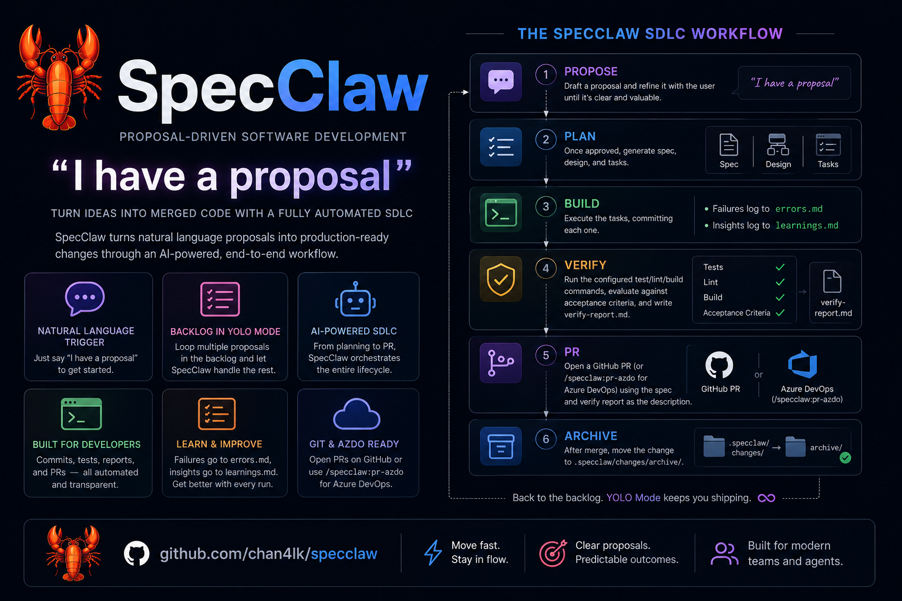

<div align="center">

# 🦞 SpecClaw

### _"I have a proposal."_

**Spec-driven development for Claude Code and Codex.** Turn a plain-English idea into merged, production-ready code through a fully automated SDLC.



[](https://github.com/chan4lk/specclaw/actions/workflows/ci.yml)
[](https://github.com/chan4lk/specclaw/releases)
[](LICENSE)
[](https://claude.com/claude-code)
[](https://github.com/chan4lk/specclaw/stargazers)
[](CONTRIBUTING.md)

</div>

Just say **"I have a proposal"** — SpecClaw manages the full lifecycle of a code change: propose → plan → build → verify → pr. It writes structured proposals, specs, designs, and ordered task lists into your project, then drives implementation through the lifecycle with full traceability from requirement to merged PR.

> **Try it in 30 seconds:** `/plugin marketplace add chan4lk/specclaw` → `/plugin install specclaw@chan4lk` → `/specclaw:init`

## Why SpecClaw?

AI coding agents are powerful but lose context fast. SpecClaw gives every change a paper trail:

- **`proposal.md`** — why this change matters
- **`spec.md`** — requirements + acceptance criteria
- **`design.md`** — technical approach, file map, key decisions, risks
- **`tasks.md`** — ordered tasks, grouped into parallelizable waves
- **`verify-report.md`** — evidence the implementation meets the spec
- **GitHub / Azure DevOps / Jira sync** — keep external trackers up to date

Each change lives in `.specclaw/changes/<NNN>-<name>/` in your repo. The plugin operates on your project's CWD; nothing is hidden inside the plugin install.

## Installation

Requires [Claude Code](https://claude.com/claude-code) v2.1 or later.

```
/plugin marketplace add chan4lk/specclaw
/plugin install specclaw@chan4lk
```

Future plugins by the same owner ship in the same `chan4lk` marketplace — you only register it once.

### Codex (marketplace install)

Codex can install the native package from this repository's marketplace:

```
codex plugin marketplace add chan4lk/specclaw --sparse .agents/plugins
codex plugin add specclaw@chan4lk
```

The marketplace entry resolves `plugins/specclaw/` from the repository root and
packages its canonical `skills/` tree. For a local checkout, replace
`chan4lk/specclaw` with the checkout path in the first command. Use an isolated
Codex home when testing a package so local validation does not alter your usual
marketplace configuration.

### Codex (repository-local adapter)

Codex discovers the adapter included in this checkout at
`.agents/skills/specclaw/`. Start Codex from the repository root (or a
descendant), then invoke **`$specclaw`** for SpecClaw lifecycle work. The
adapter delegates to the existing plugin assets under `plugins/specclaw/`; it
does not install a global skill or duplicate the Claude plugin.

## Quickstart

```
> /specclaw:init
  Initializes .specclaw/ in the current project, generates config.yaml, creates the dashboard.

> /specclaw:propose "add dark mode support"
  Drafts .specclaw/changes/001-add-dark-mode/proposal.md for your review.

> /specclaw:plan 001-add-dark-mode
  Generates spec.md, design.md, tasks.md once the proposal is approved.
  Append --author-spec to author spec.md interactively via the spec-author subagent, with an approval gate before design.md / tasks.md.

> /specclaw:build 001-add-dark-mode
  Executes tasks wave-by-wave, committing each.

> /specclaw:verify 001-add-dark-mode
  Runs tests/lint/build, evaluates against acceptance criteria, writes verify-report.md.

> /specclaw:pr 001-add-dark-mode
  Opens a GitHub PR using the spec + verify report as the description.
```

## Project Structure

When initialized in a project, SpecClaw creates:

```
.specclaw/
├── config.yaml          # Project config (models, git strategy, integrations)
├── STATUS.md            # Cross-change dashboard
├── patterns.md          # Recurring pattern registry (cross-change)
└── changes/
    └── <NNN>-<change-name>/
        ├── proposal.md      # Problem + solution + scope
        ├── spec.md          # Requirements + acceptance criteria
        ├── design.md        # Technical approach + file map
        ├── tasks.md         # Ordered tasks with status markers
        ├── status.md        # Per-change progress tracking
        ├── errors.md        # Build error journal (auto-generated on failures)
        ├── learnings.md     # Build learnings (spec gaps, patterns, insights)
        └── verify-report.md # Verification results
```

Rebuilding an existing app additionally uses `.specclaw/analysis/` (the
brownfield analysis documents), `.specclaw/baseline/` (golden-master seams,
scenarios, fixtures, manifest) and — only when the UI fidelity policy is
`FAITHFUL` or `THEME-ONLY` — `.specclaw/ui/`:

```
.specclaw/ui/
├── ui-inventory.md          # One section per screen, permanent SCR-### ids
├── design-tokens.json       # Colour/typography/spacing under permanent TK- ids
├── screenshot-checklist.md  # The human capture work order
├── screens/                 # Human-captured PNGs — never written or deleted
│                            #   by any specclaw command
├── ui-manifest.json         # sha256 + capture metadata per screenshot
└── archive/                 # Prior versions of the three design documents
```

`SCR-###` (screens) and `TK-###` (design-token groups) join the permanent ID
families — `DR-` rules, `GM-` scenarios, `BL-` backlog items,
`CQ-`/`SQ-`/`UQ-` clarify questions, `PQ-` pending questions — never
renumbered once assigned.
## Rebuilding an existing app? The `bf-*` brownfield pipeline

SpecClaw's main job is the greenfield lifecycle above. The **`bf-*` (brownfield) commands** in the table below wrap that same lifecycle in a modernisation pipeline for **rebuilding an existing application on a new stack**, with proof that the rebuild behaves like the original. Skip this section if you are not rebuilding a legacy app.

The pipeline runs across two repos. In the **legacy repo** you read, decide and prove: analyse the code into `MOD-###` modules and `DR-###` rules, turn every guess into a named question and every question into a named human's decision (`bf-clarify`), capture the old app's behaviour as hash-verified Golden Master fixtures (`bf-baseline`), derive the gated `BL-###` backlog and the target blueprint, and — only when the UI will be *reinterpreted* rather than reproduced — get the redesign approved by a named client stakeholder before anything is built (`bf-prototype`). Nothing in the legacy repo is ever modified except `.specclaw/`. In the **new repo** you build and compare: bootstrap a decided, capability-free foundation (`bf-bootstrap`), build each backlog item through the ordinary `propose → plan → build → verify → pr` lifecycle, replay the legacy fixtures against the rebuild (`bf-replay`), and drive the finished app end-to-end through its real UI (`bf-e2e`). `bf-status` shows where the workstream stands at any time.

```
LEGACY REPO   bf-analyze · bf-architecture · bf-domain → (bf-ui) → (bf-quality) → bf-clarify --resolve
              → bf-baseline --harness --record → bf-rebuild-plan → bf-blueprint → [bf-prototype, REINTERPRET only]
NEW REPO      copy .specclaw/ grounding → bf-bootstrap → propose · plan · build · verify · pr (per BL-### item)
              → bf-replay → (bf-ui --checklist) → bf-e2e → (bf-quality --target --compare)
```

Four checks, four different facts — never conflated:

| Check | Answers |
|---|---|
| `/specclaw:verify` | Does the implementation meet the change's own spec acceptance criteria? **The authoritative lifecycle verdict.** |
| `/specclaw:bf-replay` | Does the rebuild behave like the legacy app, fixture by fixture, at the same seam? |
| `/specclaw:bf-prototype` | Has a named client stakeholder approved the proposed target UI before production implementation? (`REINTERPRET` only) |
| `/specclaw:bf-e2e` | What can a real user actually do through the rebuilt app's real surface — one recorded run, not a gate |

Every `bf-*` command follows the same rules: bash computes verdicts and agents only narrate; ask-don't-guess (`NOT-MEASURED` / `PROVISIONAL(PQ-###)` beats a fabricated value); permanent IDs (`MOD-`, `ST-`, `IS-`, `QI-`, `PS-` join the families listed above) that are never renumbered; fail-closed gates that stop by naming the exact missing decision or file; and stack-blind collectors that identify the legacy and rebuild stacks per run instead of assuming them. Optional commands (`bf-ui`, `bf-quality`, and `bf-prototype` outside `REINTERPRET`) leave every other command byte-identical when their artifacts are absent. The step-by-step operating guide — checkpoints, human steps, file-copy rules, troubleshooting — is the SpecClaw Brownfield Runbook; `docs/rebuild-workflow.md` covers the same flow in prose.

## Commands

All commands are namespaced under `/specclaw:`. Most are model-invokable — Claude will route conversationally (e.g. "i have a proposal" fires `/specclaw:propose`). Auth setup commands (`/specclaw:auth-azdo`, `/specclaw:auth-jira`) are explicit-only because they handle credentials.

| Command | Purpose |
|---------|---------|
| `/specclaw:init` | Initialize `.specclaw/` in the current project |
| `/specclaw:propose "<idea>"` | Draft a new change proposal. In a brownfield rebuild, also checks the item's `Depends on:` against the backlog: an unmet **cross-module** dependency stops the proposal and elicits a **bypass strategy** (stub-interface / mock-data / feature-flag / item-split), recorded as a permanent `ST-###` entry in `.specclaw/analysis/module-stubs.md` with the human who chose it. A bypass is never agent-decided and never a default; a same-module dependency is refused rather than stubbed. **`item-split` is recorded separately** as an `IS-###` in `.specclaw/analysis/item-splits.md` — it fakes nothing, so it taints nothing and completes rather than retiring — and a split that would remove a whole layer from a screen-bearing item is **refused** without a named human confirming that consequence. Re-proposing a split item **resumes** it: propose shows what was already built with its PR/replay evidence, proposes only the remainder, and never re-asks about a dependency the split already deferred. In a rebuild repo it also checks the **target-foundation gate** first and stops with `Run /specclaw:bf-bootstrap first` when no foundation has been created. Inert on any project with no rebuild backlog |
| `/specclaw:plan <change>` | Generate spec + design + tasks (append `--author-spec` for interactive spec authoring with an approval gate) |
| `/specclaw:author-spec <change>` | Author `spec.md` interactively via the `spec-author` subagent (5 Whys, JTBD, Inversion, Pre-mortem, MoSCoW) |
| `/specclaw:build <change>` | Execute tasks wave-by-wave |
| `/specclaw:learn <change> "..."` | Record a spec gap, design miss, or pattern |
| `/specclaw:patterns` | Inspect the cross-change pattern registry |
| `/specclaw:verify <change>` | Validate implementation against spec |
| `/specclaw:pr <change>` | Open a GitHub PR |
| `/specclaw:pr-azdo <change>` | Open an Azure DevOps PR |
| `/specclaw:auth-azdo` | One-time Azure DevOps credentials setup |
| `/specclaw:auth-jira` | One-time Jira credentials setup |
| `/specclaw:issue <change>` | Create a Jira issue from a proposal |
| `/specclaw:azdo-issue <change>` | Create an Azure Boards Work Item from a proposal |
| `/specclaw:status` | Show the project dashboard |
| `/specclaw:bf-analyze [path]` | Analyze an existing/legacy codebase and write `.specclaw/analysis/codebase-report.md` (read-only) |
| `/specclaw:bf-architecture [path]` | Write a C4-model architecture view (L1→L4, Mermaid) of an existing/legacy codebase to `.specclaw/analysis/architecture.md` (read-only) |
| `/specclaw:bf-domain [path]` | Write domain/functional documentation (entities, rules, capabilities, workflows, UI inventory) of an existing/legacy codebase to `.specclaw/analysis/domain-model.md` + `.specclaw/analysis/functional-spec.md`, plus the **module map** (`.specclaw/analysis/module-map.md`) — evidence-grouped `MOD-###` migration units with owned vs referenced-but-not-owned entities, rules, services, screens and inter-module dependencies, so a large legacy system can be migrated and accepted one module at a time. The map is agent-**proposed** and human-**confirmed** (its own `Status:` line); an ambiguous boundary becomes a typed pending question instead of a silent assignment, and `MOD-###` ids are reconciled across regenerations, never renumbered (read-only) |
| `/specclaw:bf-rebuild-plan` | Read the four `.specclaw/analysis/*.md` documents and write an ordered, dependency-sequenced `.specclaw/analysis/rebuild-backlog.md` of individually-proposable features (read-only, calls no lifecycle command); marks an item `⚠ PROVISIONAL` when it rests on a still-open pending question. Items are grouped under their `## MOD-###` module in the map's own dependency order (foundations first), each declaring its `**Module:**`; the Coverage Check gains a bash-computed per-module rollup, and the status header names the **recommended next module to build** with the reasons for it. `--module MOD-###` (re)plans one module, leaving every other module's items, coverage lines, and human-added status notes untouched. Also regenerates `.specclaw/analysis/module-status.md` — a read-only per-module status view (items planned/total, scenarios captured/designed, latest module-scoped replay verdict, **stub-tainted items**, open questions), rebuilt in full every run and exempt from archive-then-replace because it holds no finding of its own; a module holding an item whose latest verdict rested on a bypass stub reads `PASS*`, and the view lists which `ST-###` entries fake that module for others. Adds a bash-computed **Stub Retirement** block (which stubs are now retirable, their consuming items, the exact replay commands, and who does each step) plus a per-item `⚠ STUB-BACKED` marker alongside `⚠ PROVISIONAL`. Also adds an **Item Splits** block and a per-item `⚠ PARTIALLY BUILT` marker from `.specclaw/analysis/item-splits.md`: which items had scope deliberately deferred, what each is still missing, and the steps to resume. This is the one place a rendering command writes into a registry — it flips a split `ACTIVE → READY-TO-RESUME` (Status line only, one direction, never back, with a WARN) once every blocked-until item carries a declared `BUILT:` note, because that transition is a pure function of declared data and a stale `ACTIVE` would be indistinguishable from nobody getting round to it. When the UI fidelity policy (`SQ-013`) is decided `FAITHFUL`/`THEME-ONLY`, also attaches each screen-bearing item's `SCR-###`/`TK-` grounding and a bash-computed UI Screen Coverage section — or, if the `/specclaw:bf-ui` artifacts are absent, one loud warning naming them and those items held at `OPEN QUESTIONS`, never a silent degradation |
| `/specclaw:bf-quality [path] [--target <path>\|--compare [--gate]]` | Measure the code quality of an existing/legacy codebase and write `.specclaw/analysis/quality.json` plus a client-curatable `quality-report.md` — per-module rollups of cyclomatic complexity, function length, duplication and file length, each classified in **bash** against thresholds that live only in `config.yaml`'s `quality:` block, so the agent narrates statuses it cannot re-derive. **Every metric that could not be computed is recorded as `NOT-MEASURED` with a machine-readable reason** (`tool_missing` / `language_unsupported` / `parse_error`) and never estimated — a language no available tool parses for complexity reports size and duplication only, and says so on the report's face above the findings rather than below them. Hotspots become permanent `QI-###` ids (`templates/CONTRACT.md` (c)) whose registry is never archived; a hotspot that clears is marked `resolved` and keeps its id and first-seen date forever, so two reports months apart are comparable. `scc`/`lizard`/`jscpd` are all **optional** — each one's absence degrades only its own metrics; `jq` is required. **Fully optional and advisory:** it blocks nothing, exits 0 even on `HIGH` findings, and no other command requires anything it produces — the one interaction is `/specclaw:bf-rebuild-plan`, whose per-module rollup gains a quality status and open-hotspot count *if* `quality.json` happens to exist and is byte-identical when it does not. `--target <path>` measures the rebuilt tree (registering no `QI-###` — those name legacy hotspots); `--compare` diffs the two and flags any dimension measured on only one side as **`NOT-COMPARABLE`** rather than banking it as an improvement; `--compare --gate` adds a bash-computed `QUALITY-GATE: PASS`/`FAIL` line and the matching exit code — the only enforcing mode anywhere in this command. Stack-blind: language handling is a data table, not a per-stack branch |
| `/specclaw:bf-bootstrap [--adopt\|--not-applicable "<why>"]` | **Create the target application foundation in the NEW (rebuild) repo**, once, before any backlog item is developed — the stage the pipeline never had, and whose absence let the first item proposed silently inherit responsibility for inventing the app skeleton. Reads the architecture the rebuild already decided (`decisions.md`'s SQ/CQ answers plus accepted ADRs) and scaffolds for it: app shell, routing shell, API client, solution/project layout, DI, config, CORS, error-handling conventions, ORM + database connectivity, migrations infrastructure, test-project structure both sides, theme plumbing, and one health-check endpoint to prove connectivity. **Implements no backlog capability** — no sign-in, no grid, no payments, not even a placeholder named after one; a foundation-only gate refuses a scaffold declaring a `capability` file, a route beyond the health check, or any `DR-###`/`BL-###`/`SCR-###` citation, and states plainly that a declared-census check cannot prove the absence of capability logic. Stack-agnostic and purely dynamic — **no per-stack scaffold template ships in the plugin**; the `bf-bootstrap-architect` agent generates the skeleton for whatever stack the decisions name, exactly as the baseline harness and replay tests are generated. Seven required decisions have no default anywhere: an unresolved one is a loud stop naming the exact `SQ-###` id, never an inference from the legacy stack. Smoke-verifies the result, then records `.specclaw/bootstrap/bootstrap-manifest.json`, which `/specclaw:propose` reads as a precondition gate. Re-running on a healthy foundation is a no-op; on a broken one it gap-fills only the failed pillars; on a repo that already has an application it stops and asks rather than scaffolding over it. **Under a `REINTERPRET` UI fidelity policy it also requires the redesign to have been approved** — a copied `prototype-manifest.json` recording `prototype_ready: true`, with `screens/` present and every screenshot hash re-verified — and scaffolds nothing otherwise; `--adopt` additionally refuses a tree that hashes identically to the approved prototype, which is design-acceptance code and not a foundation |
| `/specclaw:bf-clarify [--resolve\|--bank-only\|--options-pack]` | Turn the inferences/hedges/gaps/conflicts scattered through `.specclaw/analysis/*.md` into a numbered, classified question set (`clarifications.md`); `--resolve` promotes answered questions into a pinnable decision record (`decisions.md`) (read-only). Also ingests every OPEN entry in `pending-questions.md` — the ask-don't-guess buffer any analysis agent appends to instead of silently assuming an answer — typing each into a real `CQ-NNN` and rewriting its status to `PROMOTED → CQ-NNN` in place. `--options-pack` packages every **undecided blocking** question — any family — as `.specclaw/analysis/options-pack.md`, a **client-readable decision paper**: each question restated in plain language, 2–3 candidate options **generated at run time** from what this repo's own analysis shows (there is no curated menu of stacks or vendors anywhere in the plugin, and a hardcoded one would be an architectural defect), each option's consequences cited by `file:line`, trade-offs that are judgement rather than evidence labelled `(judgment)`, and a recommendation. It **records nothing** — the client's choice goes back through the ordinary answer → `--resolve` path, attributed to a **named human**, never to "the client" and never to an agent. Bash computes every DECIDED/UNDECIDED/NOT-APPLICABLE verdict and the header counts; the agent only writes options and recommendations. Zero pending questions is a clean state, not an error — the pack still renders, saying nothing is outstanding |
| `/specclaw:bf-blueprint` | Synthesize the decisions a rebuild has already made — `decisions.md`, `module-map.md`, `architecture.md`, `rebuild-backlog.md` — into `.specclaw/analysis/target-architecture.md`: **the target-side counterpart to `architecture.md`'s legacy view**, and the first artifact in the pipeline that shows the shape of the thing being built. Mermaid C4 diagrams (one Context, one Container, one Component per `MOD-###` grouped exactly as the backlog groups them), a **legacy→target mapping table in which every row cites the `SQ`/`CQ`/`UQ` decision that sanctions it**, and stack/persistence/hosting/auth sections where every claim carries its decision id. **It derives, it never decides**: a claim with no decision behind it renders `PROVISIONAL(<id>)` naming the open question rather than becoming a confident diagram box, and a module whose target shape is entirely undecided gets a placeholder naming what blocks it, never an invented design. Three bash gates refuse the run rather than render something misleading — an uncited mapping row, a citation to an id that does not exist, and a missing or invented module section. The `COMPLETE`/`PROVISIONAL (n unresolved blocking questions: …)` verdict in the header is computed in bash from the decision record, never asserted by an agent. Runs in the **legacy** repo like every other `bf-` analysis command; unresolved questions never stop it, and an unconfirmed `module-map.md` is a WARN in the header, never a hard stop (read-only, calls no lifecycle command) |
| `/specclaw:bf-baseline [--harness\|--record]` | Design the golden-master harness that proves a rebuild matches the legacy app: seam ranking + capture-layer declaration + determinism audit + scenarios (default), generate the runnable capture project and the project's own semantic error vocabulary in `.specclaw/baseline/error-map.md` (`--harness`), or validate a human-run capture into a manifest (`--record`) (read-only, never runs the legacy app or captures a fixture itself; dynamic multi-stack — the legacy repo's stack is identified per run, works with any language/framework, no fixed stack list, and **no error codes or framework names anywhere in the plugin**). Each scenario declares the `MOD-###` module(s) owning the rules it pins — a scenario spanning modules is tagged with **all** of them — and `--record` carries those into `manifest.json`'s `module_ids`; `--module MOD-###` designs or generates a harness for one module without disturbing another module's scenarios or generated tests. `--record` computes each fixture's `status` — `VERIFIABLE`, `PROVISIONAL` (blocked by an open pending question), or `SUPERSEDED` (the scenario's own definition changed since capture) — and **refuses to write a manifest at all** when a fixture has a normalization path matching nothing, no `outcome`/`error_code`/`threw`, an unexplained rejection, an error code missing from `error-map.md`, or a missing/invalid `seam_layer`; every problem is reported in one pass and the prior manifest is left untouched |
| `/specclaw:bf-ui [--record\|--checklist <change>]` | **Optional** UI-fidelity workstream. Default mode extracts the legacy app's UI from its source: `.specclaw/ui/ui-inventory.md` (one section per screen with a permanent `SCR-###` id — layout regions described neutrally, widget-by-widget composition cross-referenced against `domain-model.md`, navigation edges, evidenced states, every claim cited `file:line`), `design-tokens.json` (stack-neutral colour/typography/spacing tokens under permanent `TK-` group ids; an ungroundable token is omitted and raised as a pending question, never guessed), and `screenshot-checklist.md` — a **human** work order. `--record` hashes the human-captured PNGs under `.specclaw/ui/screens/` into `ui-manifest.json` (sha256 + capture metadata per `CONTRACT.md` (f)); missing captures are a normal reported state. `--checklist <change>` runs in the new repo and generates that change's `ui-review.md`: a per-screen sign-off table (legacy screenshot by hash, token values with a `file:line` to check in the new code, layout points under `FAITHFUL`) for a **named human** to sign and commit with the PR. Under a `REINTERPRET` policy, where there is no legacy appearance to reproduce, `--checklist` instead reviews against the **approved prototype screen** when `/specclaw:bf-prototype`'s manifest has been copied here — one row per recorded review point, referencing the screenshot the client signed off by `PS-###` and hash — and keeps its original refusal when no prototype exists. Read-only; never runs the legacy app, never takes or simulates a screenshot, never declares a fidelity verdict. Stack-agnostic — the view technology is identified per run by reading the repo |
| `/specclaw:bf-prototype [--brief-only\|--record]` | **Mandatory when `SQ-013` is decided `REINTERPRET`, and entirely absent otherwise** — a project on `FAITHFUL`, `THEME-ONLY` or an undecided policy never sees this command and every other command is byte-identical to a build without it. Where a rebuild redesigns its interface rather than reproducing it, somebody has to agree to the new design, and the only moment that agreement is cheap is **before the application exists**. So this stage stands between the legacy analysis and the whole new repo: `/specclaw:bf-bootstrap` refuses to scaffold and `/specclaw:propose` refuses every item until it prints `PROTOTYPE: READY`. Default mode writes `.specclaw/prototype/prototype-brief.md` — one section per redesigned screen, each mapped to the `SCR-###` it replaces and citing the `DR-###`/`BL-###` evidence for every field, rule and workflow step — allocates a permanent `PS-###` per screen from an append-only registry, and hands the brief to the UI/prototype skill named in `config.yaml`'s `prototype.skill`. **specclaw contains no UI generator**: it owns the records and the gates, never the prototype. The prototype is built in **exactly** the frontend framework *and* language the project decided, each resolved from the decision record with its citation (`SQ-006`, `SQ-015`) — neither is ever defaulted, and a framework name alone never implies a language, so a rebuild that answered only `SQ-006` is stopped by name rather than silently inheriting its framework's convention. Any change the redesign proposes to *what the system does* — a field removed, a validation altered, a workflow merged, a status transition changed — is emitted as a `PQ-###`, never built silently; until a human decides it, bash refuses to compute that screen approved. `--record` hashes the prototype tree and the human-captured screenshots under `screens/`, joins the verdicts a **named client stakeholder** wrote into `prototype-approvals.md` (written by a human and by no agent or script, ever), and computes every status and the readiness line in bash — an approval is bound to the exact `tree_hash` it was given against, so editing the prototype afterwards reads `STALE`. Readiness is measured against the **rebuild backlog**, so screens the client scoped out never block it. The prototype is **thrown away**: never copied to the new repo, never a bootstrap input, and `--adopt` refuses it by hash. Only `prototype-map.md`, `prototype-manifest.json` and `screens/` travel |
| `/specclaw:bf-replay <change-name>\|--item BL-###\|--module MOD-###\|--all` | Replay captured legacy fixtures against the new app's actual behaviour and report MATCH/DIVERGES/ERROR per fixture; retains a committable evidence package by default, including the full pipeline record the verdict was computed from (read-only against app source, fixtures, manifest, and error map; dynamic multi-stack — the rebuild repo's stack is identified per run, works with any legacy and any rebuild stack). Every divergence is **classified in bash**: `behavioural` (the rebuild decided differently — checked against `decisions.md` for a sanctioning decision, and FAIL without one), `representation` (identical decision, different framework exception type/message — reported with both raw values, never a failure), or `unmapped-error-code` (nobody could map the error to a semantic code, so nobody guessed). A replay test written at any seam layer other than the fixture's own is forced to `NOT REPLAYABLE`/`seam-mismatch` whatever the agent claimed. Four mutually exclusive selection scopes — a change's cited BL item, `--item BL-###` (one backlog item on its own, needing no change directory), `--module MOD-###` (a pure jq join on the manifest's `module_ids`, so a large legacy system can be behaviourally accepted one module at a time), or the whole corpus; selection only, with verdict logic and exit codes identical across all four. **Change- and item-scoped selection joins on the backlog item's own acceptance-basis `DR-###` citations** against each manifest entry's `business_rules_pinned` — the same chain `/specclaw:bf-rebuild-plan` computes each item's `Verification: … fixtures:` line from, so a run's selection and the backlog's own claim about that item are testably equal. `verifies_backlog_item` is a cross-check only and never load-bearing: the pipeline records a baseline *before* the backlog exists, so a first-recorded manifest carries the `not yet backlog-linked` placeholder on every entry (ignored silently; a populated value that disagrees is a WARN naming both sets). An active item with genuinely zero fixtures behind it is a clean `INCOMPLETE` (exit 2) stating `NO BASELINE DATA — 0 fixtures mapped to BL-###` — never a precondition crash and never an invented fixture. The report gains a per-module rollup whose **cross-module honesty rule** counts a shared fixture toward every module it touches and always states how many of a module's fixtures are shared with which others — a module verdict that hid its shared flows would be a false verdict. A `PROVISIONAL` or `SUPERSEDED` fixture, or an unmapped code, holds the overall verdict at `PASS-PENDING-DECISIONS` (exit code 1, gates CI/PR like FAIL) instead of `PASS` — soft-block, never a refusal to run, and never a downgrade of a real FAIL  A fixture verifying an item built against an **active bypass stub** (`ST-###`) is stamped stub-tainted: the verdict line gains `(with active stubs: …)`, a **Stubs In Effect** section names what each fakes, and the evidence metadata records it — but taint changes no verdict, no divergence class, and no exit code, and never softens a FAIL. An `--item` run whose item carries an open `IS-###` split reports `(partial — split IS-###)` after the verdict token, names which of its fixtures cover built versus deferred scope, and states on the report's face that the run **is not that item's final acceptance** — a statement about scope, where taint is a statement about standing. Deferred-scope fixtures are reported, never excluded: dropping one would change what the run FAILs on and hide a real regression behind a scope note, so a FAIL among them is explained and a **PASS among them is flagged as worth investigating** |
| `/specclaw:bf-e2e [path\|"<flow description>"]` | **Drive the rebuilt application end-to-end through its real user surface, and record one run.** Runs in the **new** repo as a read-only side-command (no change directory). The `bf-e2e-architect` agent detects — from source evidence gathered in that run, never assumption — the platform (Web / Desktop / Mobile / Hybrid / Embedded), the stack (read from manifests, not guessed from extensions), the real user-facing entry surface, any locator convention already present (`data-testid`, `AutomationID`, `AccessibilityID`, `resource-id` — imitated, never replaced), and existing test tooling, explicitly distinguishing unit/API tooling from true UI E2E. It selects **one** best-fit E2E framework with a justification tied to that evidence — no fixed list, never Playwright/Cypress by default — and generates a Page Object Model plus runnable tests under the repo's E2E convention (or a plain `e2e/`), never inside a unit-test directory and never touching application source. **The E2E surface rule is non-negotiable:** a web app is driven through a real rendered browser, desktop through its native UI, mobile through its mobile UI; an HTTP/API boundary is the E2E surface only when the app genuinely has no UI for the flow. Scenarios and expected outcomes come from the flow you describe and from the **rebuilt application's own** observable rules (validation, actions and the state they cause, guards, navigation), each cited to a file read that run — **it runs independently of `bf-baseline` and reads no Golden Master fixture**; fixture-level fidelity stays `bf-replay`'s job. A rejection is asserted as the user-observable rejection, never a raw exception or an internal code the UI doesn't expose; a flow that cannot be driven through the required surface is listed under **Gaps** with its reason, never relabelled as E2E via an API fallback. Writes `.specclaw/e2e/e2e-report.md` (Detection Summary → Setup / Execution Commands → Page Objects → Test Scripts grouped by business module with an `Evidence:` line per scenario → Gaps) and `run-config.json` (ordered background services with `check_cmd`/`start_cmd`, `install_cmd`, `test_cmd`, `artifacts_dir`), then `specclaw-bf-e2e-run` executes the suite once — starting only services not already running, in declared order — and mechanically patches real Pass / Fail / Skipped counts, Pass Percentage, on-failure screenshots/video into the report and renders `e2e-report.html` for non-technical stakeholders. Unparseable output reads `NOT MEASURED`; a failed install or a service that never became ready reads "not executed" with its reason. **A one-off recorded E2E run, not a lifecycle acceptance gate** — it blocks nothing, `pr` and `loop` do not read it, and `/specclaw:verify` remains the authoritative verdict. Prior reports are archived under `.specclaw/e2e/archive/`. Stack-agnostic |
| `/specclaw:bf-status` | **Show where the brownfield rebuild actually stands** — the `bf-*` counterpart to `/specclaw:status`, which reports the `propose → plan → build → verify` lifecycle and says nothing about the rebuild pipeline. One row per phase (codebase report, architecture, domain + module map, clarifications, UI fidelity, golden-master baseline, rebuild backlog, target blueprint, target foundation, replay acceptance), each derived from that phase's **own** declared artifact and nothing else — an absent document reads `—` (not run), never "probably fine" — plus a **Needs attention** work list (blocking questions unanswered, fixtures or screenshots not captured, module map unconfirmed) and a single **Next** line naming the earliest unstarted phase. The replay row reports the latest verdict **per target**, never the newest run overall, and a verdict earned on an `ACTIVE` bypass stub reads `PASS*`. Deterministic, read-only, cheap: it **writes nothing**, runs no agent, reads no application source, invokes no other command, and never says a phase, module or item is *done* — specclaw records no built state beyond a status note a human typed. `jq` is optional (without it the UI, baseline, bootstrap and replay rows report file counts and say so). Complements, never duplicates, the per-module `module-status.md` written by `/specclaw:bf-rebuild-plan` |
| `/specclaw:archive <change>` | Archive a completed change |
| `/specclaw:auto` | Advance the queue of active changes autonomously |

## Configuration

`.specclaw/config.yaml`:

```yaml
version: 1
project:
  name: "my-project"
  description: "Short description"

models:
  planning: "anthropic/claude-opus-4-6"
  coding: "openai/gpt-5.1-codex"
  review: "anthropic/claude-sonnet-4-5"

git:
  strategy: "branch-per-change"   # or "direct", or "worktree-per-change"
  base_branch: ""                 # empty = auto-detect (origin/HEAD → gh default → main/master)
  auto_commit: true
  commit_prefix: "specclaw"

github:
  sync: true
  repo: "owner/repo"
  label: "specclaw"

azdo:                              # set via /specclaw:auth-azdo
  org: ""
  project: ""
  repo: ""

jira:                              # set via /specclaw:auth-jira
  domain: ""
  email: ""
  project_key: ""

automation:
  auto_verify: true
  auto_archive: false
  max_tasks_per_run: 5

workflow:
  strict: true
  code_review: false               # Spawn code-reviewer agent on /specclaw:verify
  code_review_block: false         # Block /specclaw:pr if code review finds BLOCK issues

context:
  discovery: true                  # Auto-discover project docs for phase payloads
  max_lines: 3000                  # Line budget for injected docs
  folders: []                      # Restrict discovery (empty = whole repo)
  pin: []                          # Always-include paths
  exclude: []                      # Patterns to skip
```

### Update Check

`/specclaw:status` quietly checks the plugin repo for a newer published version (at most once per 24h, cached in `.specclaw/.update-check` — add it to your `.gitignore`) and shows a one-line upgrade hint when one exists. Fail-silent by design: network problems never affect any command. Set `plugin.update_check: false` in config.yaml for zero network calls. No other lifecycle command touches the network for this.
### Grounded Context Discovery

SpecClaw grounds its planning and review in the documentation your project already has. With `context.discovery: true` (the default), `specclaw-discover-context` scans the repo (`git ls-files`, so `.gitignore` is respected) and injects a budget-capped digest of your docs into the plan, build, and verify payloads — after the curated `.specclaw/context.md` and knowledge base, which always take priority.

Candidates are ranked: files listed in a root **`llms.txt`** / `llms-full.txt` index first, then root canonical docs (`CLAUDE.md`, `AGENTS.md`, `README.md`, `CONTRIBUTING.md`, `ARCHITECTURE.md`, `CODE-CONVENTIONS.md`, `SECURITY.md`), then doc directories (`docs/`, `doc/`, `.github/`, `wiki/`), then nested `README.md`/`CLAUDE.md`, then other markdown. Changelogs, licenses, code-of-conduct files, `archive/`/`deprecated/`/`i18n/` content, dependency directories, and `.specclaw/` itself are excluded by default.

Filter precedence per file: `exclude` match → out; `folders` non-empty and file outside → out; otherwise in. `pin` entries bypass filtering and ranking. Exclude patterns support simple names (`node_modules`), root-relative paths (`./x`), and globs (`*.gen.md`, `**/dist`). Over-budget files are never dropped silently — every casualty is named in the digest footer. `/specclaw:plan` records the docs it used in a "Grounding sources" section of `design.md`. Set `context.discovery: false` for the exact pre-discovery behavior.
### Base Branch Detection

Change branches fork from — and merges/PRs target — the repo's actual base branch, resolved as: `git.base_branch` config override → `origin/HEAD` (self-healing via `git remote set-head origin --auto`) → `gh` default branch → `main`/`master` fallback. New change branches start from `origin/<base>` (fetched, offline-safe), never silently from whatever HEAD happens to be; creating a branch while off-base prints a warning so stacking is always deliberate. Repos on `develop`, `trunk`, or release branches work without configuration; set `git.base_branch` explicitly to pin a release flow.

### Code Review

Set `workflow.code_review: true` to enable an automated code review step inside `/specclaw:verify`. After the acceptance-criteria check, a `code-reviewer` agent reviews changed files across 10 dimensions (correctness, security, YAGNI, one-liner opportunities, naming, complexity, test quality, design adherence, scope creep, dead code) and writes `review-report.md` with `APPROVED`, `CHANGES_REQUESTED`, or `APPROVED_WITH_NOTES`.

Set `workflow.code_review_block: true` to hard-block `/specclaw:pr` when the review verdict is `CHANGES_REQUESTED`. Defaults to `false` so existing projects are unaffected.

### Long-Running Test Suites

Suites that take minutes used to look like hangs: no output while they ran, so a session could tear itself down mid-run and then re-run the whole thing from scratch. `specclaw-run-long` now executes every configured test/lint/build/e2e command detached — heartbeats go to stderr, a capped tail to stdout, and the full log plus a HEAD-stamped sidecar to `<change>/logs/`. Because the sidecar records the commit and tree state, a re-verify at the same clean HEAD reuses the previous result instead of paying for it twice.

Browser suites get their own tier, so a slow e2e run never blocks the fast feedback loop:

| Key | Default | Purpose |
|-----|---------|---------|
| `build.e2e_command` | `""` | Slow tier (browser/e2e), run separately from `test_command`. Empty → no e2e tier. |
| `verify.e2e` | `last` | When the slow tier runs: `skip`, `last` (only after lint/build/test pass), or `always`. |
| `verify.heartbeat_seconds` | `60` | Liveness heartbeat interval for long commands. |
| `verify.playwright.max_memory_mb` | `4096` | Memory ceiling per e2e invocation, applied via `systemd-run --scope`. |
| `verify.playwright.projects` | `[]` | Playwright project names to run one-per-invocation, sequentially. Empty → a single invocation. |

Every key is optional and absent keys mean unchanged behaviour. Playwright commands are pinned to `--workers=1` unless you set `--workers` yourself, and are capped at `max_memory_mb` when `systemd-run` is usable (probed, not assumed — an unusable one runs the command uncapped and says so). A run killed at the cap is reported as *memory limit exceeded*, never as an ordinary test failure. Skips are reported as skips: verify's payload carries an explicit `e2e_state` of `passed`, `failed`, `skipped_policy`, `skipped_gate_failure`, or `not_configured`, so a suite that never ran can't be read as a green one.

### Evidence-Grounded Agent Payloads

Agent prompts follow published prompt-engineering guidance from Anthropic and OpenAI: coding agents are instructed to investigate before answering (never speculate about unopened code) and to write general-purpose solutions (tests verify correctness, they don't define it); verify and review agents must quote the exact spec/code/output lines a verdict rests on — unquotable claims are dropped; payloads put longform context first and the task last; loop fix agents carry reversibility rules (no force-push, no `--no-verify`, no destructive shortcuts to green a gate).

## Workflow

1. **Propose** — draft a proposal, refine it with the user.
2. **Plan** — once approved, generate spec + design + tasks.
3. **Build** — execute the tasks, committing each one. Failures log to `errors.md`; insights log to `learnings.md`.
4. **Verify** — run the configured test/lint/build commands, evaluate against acceptance criteria, write `verify-report.md`.
5. **PR** — open a GitHub PR (or `/specclaw:pr-azdo` for Azure DevOps) using the spec and verify report as the description.
6. **Archive** — after merge, move the change to `.specclaw/changes/archive/`.

## Plugin Architecture

This repo is the `chan4lk` plugin marketplace. The specclaw plugin lives at `plugins/specclaw/` and is the marketplace's first plugin:

```
specclaw/                            ← chan4lk marketplace root
├── .claude-plugin/marketplace.json
├── .agents/plugins/marketplace.json ← Codex marketplace catalog
├── .agents/skills/specclaw/SKILL.md ← Codex repository-local adapter
└── plugins/
    └── specclaw/
        ├── .claude-plugin/plugin.json
        ├── .codex-plugin/plugin.json
        ├── skills/<verb>/SKILL.md   ← 15 namespaced skills
        ├── bin/specclaw-*           ← lifecycle scripts on $PATH
        ├── templates/               ← proposal.md, spec.md, etc.
        └── references/              ← agent prompts, build engine docs
```

Scripts resolve plugin-internal resources via `$CLAUDE_PLUGIN_ROOT` and operate on the host repo's current working directory for `.specclaw/` state — nothing is written inside the plugin install.

## License

MIT

## Contributing

PRs welcome. See [CONTRIBUTING.md](CONTRIBUTING.md).
